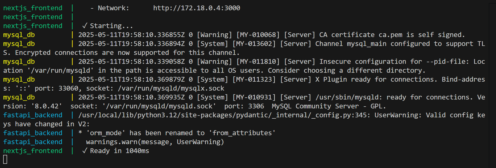
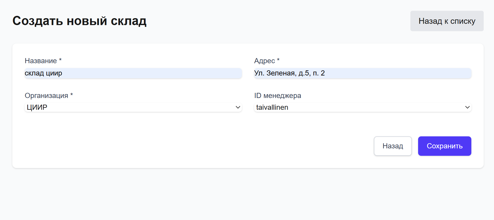
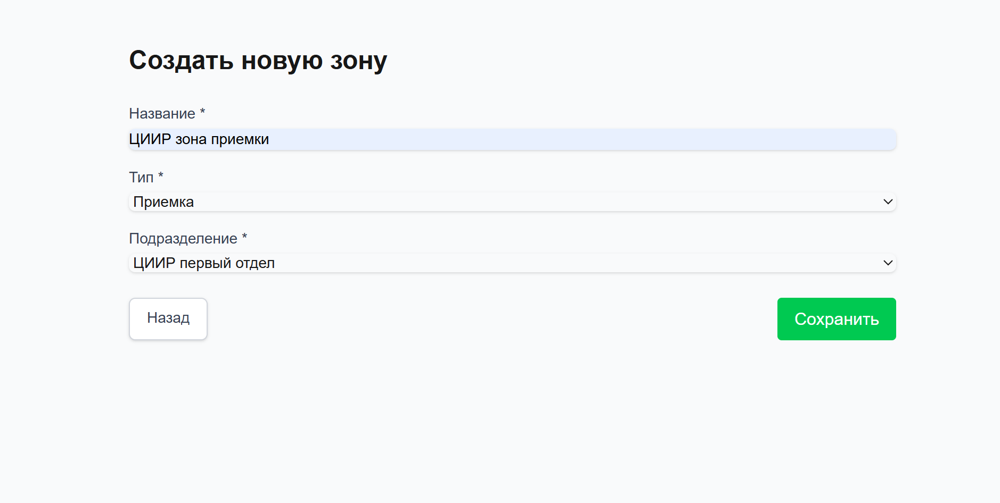
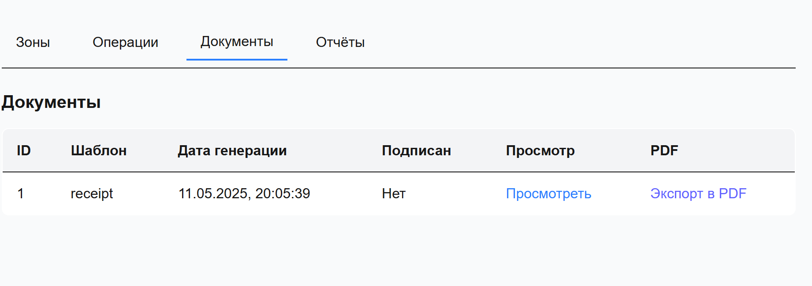
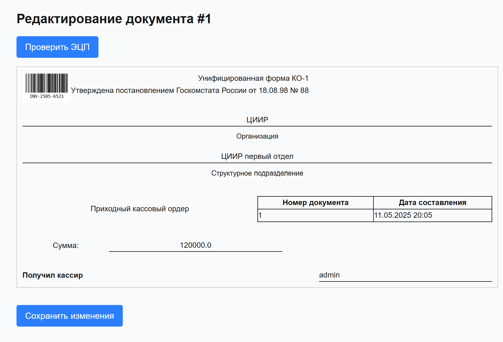
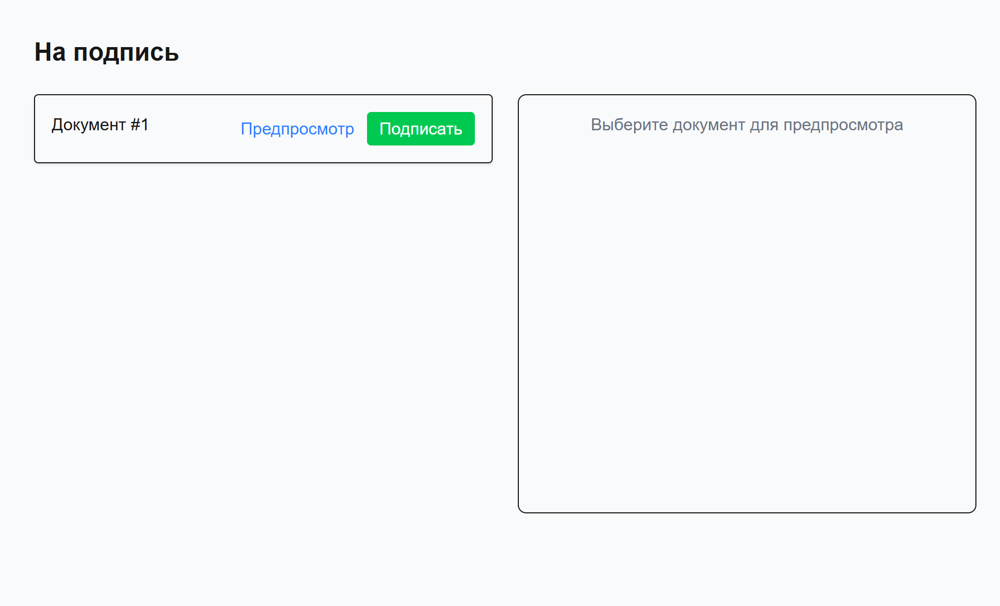
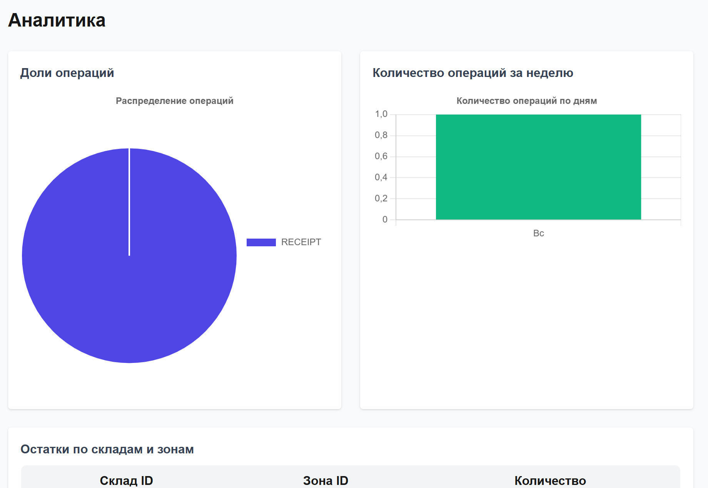

---

# 📦 Инструкция по работе с системой управления складом

> Документация для запуска, настройки и базового использования системы

---

## ⚙️ Шаг 1: Запуск приложения


### 1. Запустите приложение:

```bash
cd it-storage
docker-compose up --build
```

>   
*Рисунок 1: Успешный запуск приложения*

---

## 🏗️ Шаг 2: Создание склада, зоны и операции

### 1. Перейдите на вкладку склада:

```
http://localhost:8000/warehouses
```

### 2. Создайте склад


>   
*Рисунок 3: Создание склада через интерфейс приложения*

---

### 3. Создайте зону на складе

>   
*Рисунок 4: Создание зоны на складе*

---

### 4. Создайте операцию (например, приём оборудования)

>   
*Рисунок 5: Транзакция типа "Приём"*

---

## 📄 Шаг 4: Генерация и подписание документа

### 1. Сгенерируйте документ

При совершении операции документ генерируется автоматически


>   
*Рисунок 6: Документ на складе*


>   
*Рисунок 7: Просмотр документа*


---

### 2. Перейдите в раздел подписи документов

Нажмите кнопку **"Подписать"**

>   
*Рисунок 8: Подписание документа*

---


## 📊 Шаг 5: Генерация PDF

### 1. Вернитесь на список документов склада


Нажмите кнопку **"Экспорт в PDF"**


## 📊 Шаг 6: Аналитика

Перейдите на боковой панели в раздел аналитики


Вы увидите:
- Круговую диаграмму типов операций
- Гистограмму количества операций за неделю
- Таблицу остатков по зонам
- Список зон с низким остатком

>   
*Рисунок 9: Страница аналитики с графиками*

---


## Электронная подпись

Подпись генерируется из приватного ключа пользователя и полезной нагрузки, зависящей от документа.

Верификация подписи происходит с помощью публичного ключа пользователя


---

## 📌 Заключение

Эта система позволяет:
- Управлять складами, зонами и объектами
- Выполнять операции с оборудованием
- Генерировать и подписывать документы
- Строить аналитику

---

